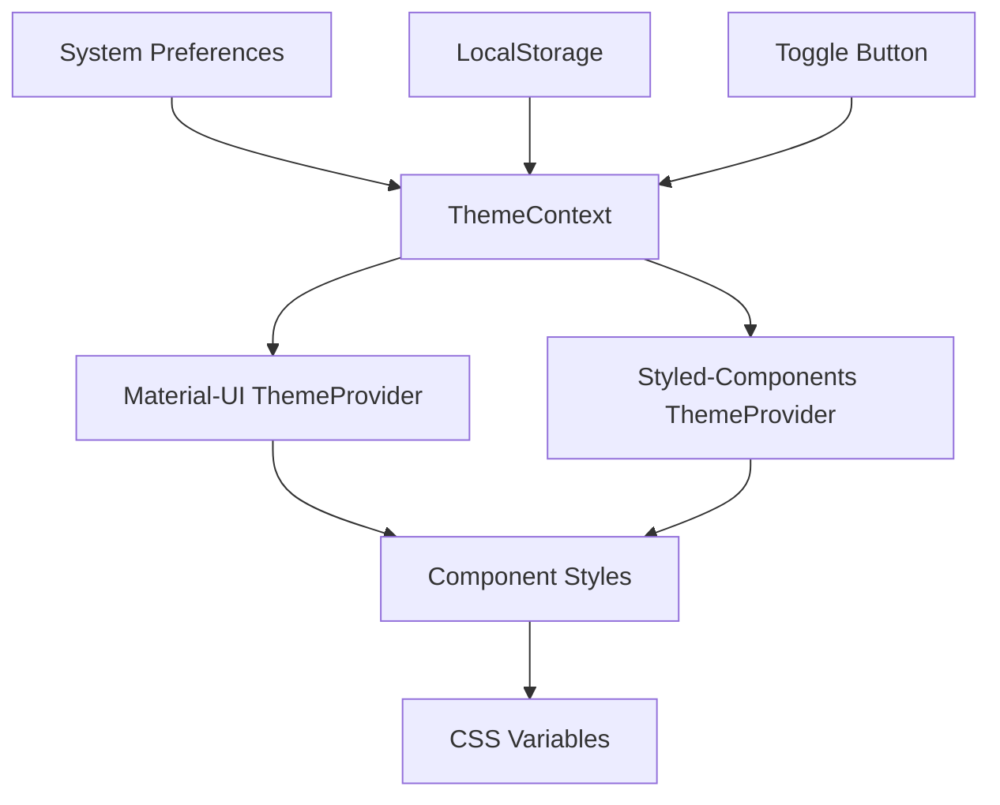

# Design Document

## Overview

The dark mode fix will enhance the existing theme system to ensure proper functionality across all components. The current implementation has the foundation in place with ThemeContext and Material-UI integration, but needs improvements in CSS variable management, component styling consistency, and system preference detection.

## Architecture

### Theme System Architecture



The theme system uses a hierarchical approach:
1. **ThemeContext** - Central state management for theme preference
2. **Material-UI ThemeProvider** - Handles Material-UI component theming
3. **Styled-Components ThemeProvider** - Handles custom styled components
4. **CSS Variables** - Provides fallback and global styling support

## Components and Interfaces

### Enhanced ThemeContext

The existing ThemeContext will be enhanced with:

```typescript
interface ThemeContextValue {
  isDarkMode: boolean;
  toggleDarkMode: () => void;
  systemPreference: 'light' | 'dark';
  userPreference: 'light' | 'dark' | null;
  isSystemPreferenceDetected: boolean;
}
```

**Key Enhancements:**
- System preference detection using `prefers-color-scheme` media query
- Distinction between user preference and system preference
- Initialization logic that respects system preferences for first-time users

### CSS Variables System

Enhanced CSS variables in `index.css` for consistent theming:

```css
:root {
  /* Light theme variables */
  --theme-bg-primary: #ffffff;
  --theme-bg-secondary: #f5f5f5;
  --theme-text-primary: #333333;
  --theme-text-secondary: #666666;
  --theme-border: #e0e0e0;
  --theme-shadow: rgba(0, 0, 0, 0.1);
}

[data-theme="dark"] {
  /* Dark theme variables */
  --theme-bg-primary: #121212;
  --theme-bg-secondary: #1e1e1e;
  --theme-text-primary: #ffffff;
  --theme-text-secondary: #b3b3b3;
  --theme-border: #333333;
  --theme-shadow: rgba(255, 255, 255, 0.1);
}
```

### Material-UI Theme Configuration

Enhanced theme objects with comprehensive color palettes:

```javascript
const createAppTheme = (mode) => createTheme({
  palette: {
    mode,
    primary: {
      main: mode === 'dark' ? '#90caf9' : '#1976d2',
    },
    background: {
      default: mode === 'dark' ? '#121212' : '#ffffff',
      paper: mode === 'dark' ? '#1e1e1e' : '#ffffff',
    },
    text: {
      primary: mode === 'dark' ? '#ffffff' : '#333333',
      secondary: mode === 'dark' ? '#b3b3b3' : '#666666',
    },
  },
  components: {
    // Enhanced component overrides for consistent theming
  }
});
```

## Data Models

### Theme Preference Storage

```typescript
interface ThemePreference {
  userPreference: 'light' | 'dark' | null;
  timestamp: number;
  version: string; // For future migration support
}
```

**Storage Strategy:**
- Use localStorage key: `marlang_theme_preference`
- Store as JSON object for extensibility
- Include timestamp for potential cleanup/migration

### System Preference Detection

```typescript
interface SystemThemeDetector {
  currentPreference: 'light' | 'dark';
  isSupported: boolean;
  addListener: (callback: (preference: string) => void) => void;
  removeListener: (callback: (preference: string) => void) => void;
}
```

## Error Handling

### Theme Loading Errors

1. **LocalStorage Access Errors**
   - Fallback to system preference
   - Log error for debugging
   - Continue with default light theme if all else fails

2. **System Preference Detection Errors**
   - Graceful degradation to light theme
   - Disable system preference features
   - Maintain manual toggle functionality

3. **Theme Application Errors**
   - CSS variable fallbacks ensure basic styling
   - Component-level error boundaries prevent crashes
   - Reset to light theme as last resort

### Performance Considerations

1. **Theme Switching Performance**
   - Use CSS transitions for smooth changes
   - Debounce rapid toggle attempts
   - Optimize re-renders with React.memo where appropriate

2. **Initial Load Performance**
   - Apply theme before first render to prevent flash
   - Use CSS variables for immediate styling
   - Minimize theme calculation overhead

## Testing Strategy

### Unit Tests

1. **ThemeContext Tests**
   - Theme toggle functionality
   - LocalStorage integration
   - System preference detection
   - Error handling scenarios

2. **Component Theme Tests**
   - Styled-components theme prop usage
   - Material-UI theme integration
   - CSS variable application

### Integration Tests

1. **Theme Persistence Tests**
   - Cross-session theme retention
   - System preference override behavior
   - Migration from old storage format

2. **Visual Regression Tests**
   - Component appearance in both themes
   - Transition smoothness
   - Accessibility contrast ratios

### Manual Testing Scenarios

1. **User Experience Tests**
   - First-time user with dark system preference
   - First-time user with light system preference
   - Returning user with saved preference
   - Theme toggle responsiveness
   - Cross-browser compatibility

2. **Accessibility Tests**
   - Color contrast ratios in both themes
   - Focus indicators visibility
   - Screen reader compatibility
   - High contrast mode compatibility

## Implementation Phases

### Phase 1: Core Theme System Enhancement
- Enhance ThemeContext with system preference detection
- Update CSS variables system
- Fix Material-UI theme configuration

### Phase 2: Component Styling Fixes
- Audit and fix styled-components
- Update CSS classes for dark mode support
- Ensure consistent theming across all components

### Phase 3: Performance and Polish
- Add smooth transitions
- Optimize theme switching performance
- Implement comprehensive error handling

### Phase 4: Testing and Validation
- Implement automated tests
- Conduct accessibility audits
- Perform cross-browser testing