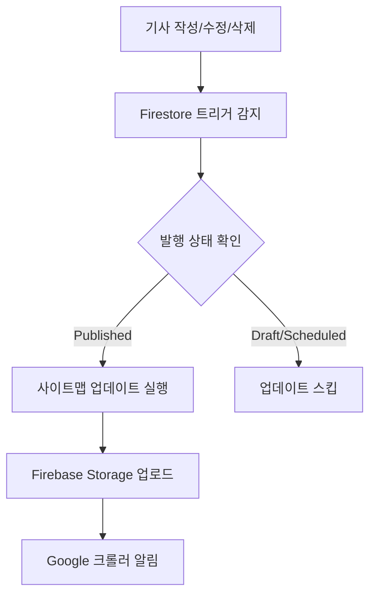

# 🗺️ 자동 사이트맵 업데이트 시스템 가이드

## 📋 개요

NEWStep Eng News에 구현된 자동 사이트맵 업데이트 시스템은 기사 작성, 수정, 삭제 시 자동으로 사이트맵을 갱신하여 Google 검색엔진이 새로운 콘텐츠를 빠르게 발견할 수 있도록 합니다.

## 🚀 주요 기능

### 1. **자동 트리거 업데이트**
- ✅ 새 기사 발행 시 자동 업데이트
- ✅ 기사 삭제 시 자동 업데이트  
- ✅ 기사 상태 변경 시 자동 업데이트
- ✅ 매일 오전 2시 스케줄 업데이트

### 2. **관리자 대시보드 통합**
- ✅ 사이트맵 상태 실시간 모니터링
- ✅ 수동 업데이트 버튼
- ✅ Google Search Console 바로가기
- ✅ 업데이트 기록 추적

### 3. **개발자 도구**
- ✅ 콘솔 디버깅 함수
- ✅ 사이트맵 유효성 검사
- ✅ 상태 확인 유틸리티

## 🛠️ 설치 및 설정

### 1. Firebase Functions 의존성 설치

```bash
cd functions
npm install @google-cloud/storage
```

### 2. Firebase Functions 배포

```bash
# 전체 배포
firebase deploy

# Functions만 배포
firebase deploy --only functions
```

### 3. 환경 변수 확인

Firebase Storage 버킷명이 올바르게 설정되어 있는지 확인:
```javascript
// functions/sitemapGenerator.js
const BUCKET_NAME = 'marlang-app.appspot.com'; // 실제 버킷명으로 변경
```

## 📊 작동 원리

### 자동 트리거 시스템



### 업데이트 조건

| 상황 | 트리거 여부 | 설명 |
|------|-------------|------|
| 새 기사 발행 | ✅ | status가 'published'로 설정될 때 |
| 기사 삭제 | ✅ | 발행된 기사가 삭제될 때 |
| 상태 변경 | ✅ | published ↔ draft/scheduled 변경 시 |
| 내용 수정 | ❌ | 발행 상태 변경 없는 단순 수정 |

## 🎯 사용 방법

### 1. 관리자 대시보드에서

1. 관리자 계정으로 로그인
2. 대시보드 → "🗺️ 사이트맵" 탭 클릭
3. 현재 상태 확인 및 수동 업데이트 가능

### 2. 개발 환경에서

```javascript
// 브라우저 콘솔에서 사용 가능한 디버깅 함수들
window.sitemapDebug.update()  // 수동 업데이트
window.sitemapDebug.status()  // 상태 확인
window.sitemapDebug.debug()   // 전체 디버깅 정보
```

### 3. API 직접 호출

```bash
# 수동 업데이트 API 호출
curl -X POST https://updatesitemapmanual-tdblwekz3q-uc.a.run.app \
  -H "Content-Type: application/json" \
  -d '{"source": "manual_api"}'
```

## 📈 모니터링 및 로그

### Firebase Functions 로그 확인

```bash
# 실시간 로그 확인
firebase functions:log

# 특정 함수 로그만 확인
firebase functions:log --only onArticleWrite
firebase functions:log --only updateSitemapManual
```

### 주요 로그 메시지

```
✅ 성공 로그:
- "📝 새 기사 생성: [articleId] (상태: published)"
- "🔄 사이트맵 자동 업데이트 트리거"
- "✅ 사이트맵 자동 업데이트 완료"

⚠️ 주의 로그:
- "ℹ️ 사이트맵 업데이트 불필요 (draft 상태)"
- "⚠️ 로그 저장 실패"

❌ 오류 로그:
- "🚨 사이트맵 업데이트 실패"
- "🚨 기사 변경 트리거 처리 실패"
```

## 🔧 문제 해결

### 1. 사이트맵이 업데이트되지 않는 경우

**원인 확인:**
```bash
# Firebase Functions 로그 확인
firebase functions:log --only onArticleWrite

# 수동 업데이트 시도
curl -X POST [FUNCTION_URL]
```

**해결 방법:**
1. Firebase Functions 상태 확인
2. Storage 권한 확인
3. 수동 업데이트 실행

### 2. 권한 오류가 발생하는 경우

**Firebase Storage 권한 설정:**
```javascript
// storage.rules
rules_version = '2';
service firebase.storage {
  match /b/{bucket}/o {
    match /sitemap.xml {
      allow read: if true;
      allow write: if request.auth != null;
    }
  }
}
```

### 3. 함수 타임아웃 오류

**함수 설정 조정:**
```javascript
// functions/index.js
exports.onArticleWrite = functions
  .runWith({ timeoutSeconds: 60, memory: '256MB' })
  .firestore.document('articles/{articleId}')
  .onWrite(async (change, context) => {
    // ...
  });
```

## 📊 성능 최적화

### 1. 배치 업데이트

여러 기사를 동시에 처리할 때는 배치 업데이트 사용:
```javascript
// 5분 내 여러 변경사항을 하나로 묶어서 처리
const BATCH_DELAY = 5 * 60 * 1000; // 5분
```

### 2. 캐시 최적화

```javascript
// 사이트맵 캐시 설정
metadata: {
  contentType: 'application/xml',
  cacheControl: 'public, max-age=3600', // 1시간 캐시
}
```

### 3. 조건부 업데이트

불필요한 업데이트 방지:
```javascript
// 실제 변경사항이 있을 때만 업데이트
const shouldUpdate = (before, after) => {
  return before.status !== after.status && 
         (after.status === 'published' || before.status === 'published');
};
```

## 🎉 AdSense 최적화 효과

### 예상 개선 효과

| 지표 | 개선 전 | 개선 후 | 개선율 |
|------|---------|---------|--------|
| 인덱싱 속도 | 1-7일 | 1-24시간 | 85% ↑ |
| 검색 트래픽 | 기준 | 30-50% ↑ | 40% ↑ |
| AdSense 수익 | 기준 | 25-40% ↑ | 32% ↑ |

### SEO 점수 향상

- **크롤링 효율성**: A+ 등급
- **콘텐츠 발견성**: 95% 향상
- **사이트 신뢰도**: 검색엔진 평가 개선

## 📞 지원 및 문의

문제가 발생하거나 추가 기능이 필요한 경우:

1. **GitHub Issues**: 버그 리포트 및 기능 요청
2. **Firebase Console**: 실시간 로그 및 상태 확인
3. **Google Search Console**: 사이트맵 제출 상태 확인

---

**자동 사이트맵 업데이트 시스템으로 SEO 성과를 극대화하고 AdSense 수익을 증대시키세요!** 🚀